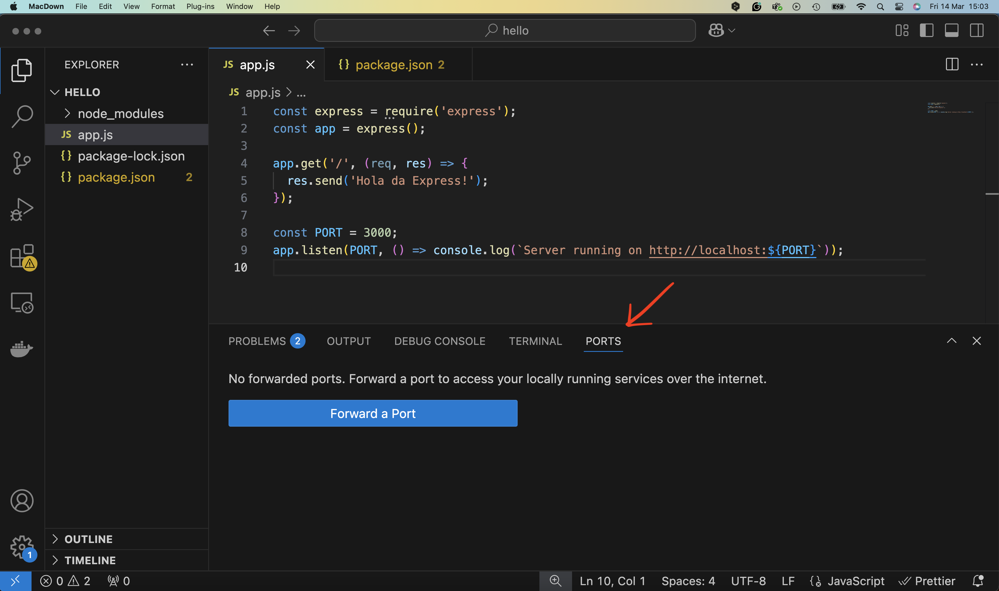
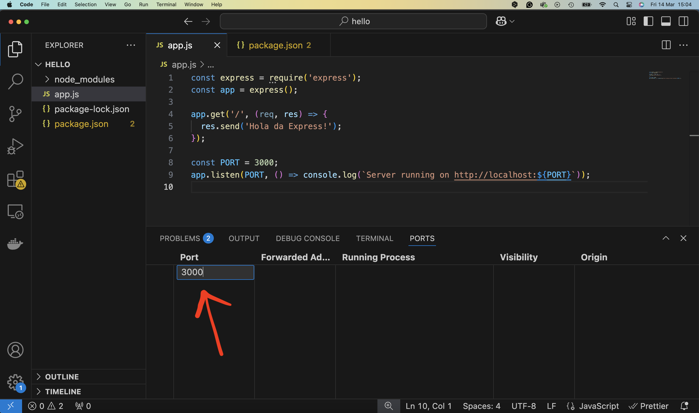
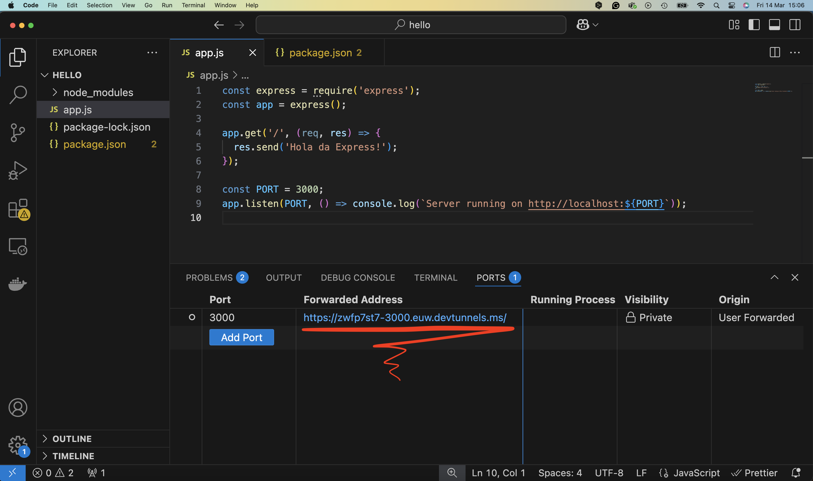
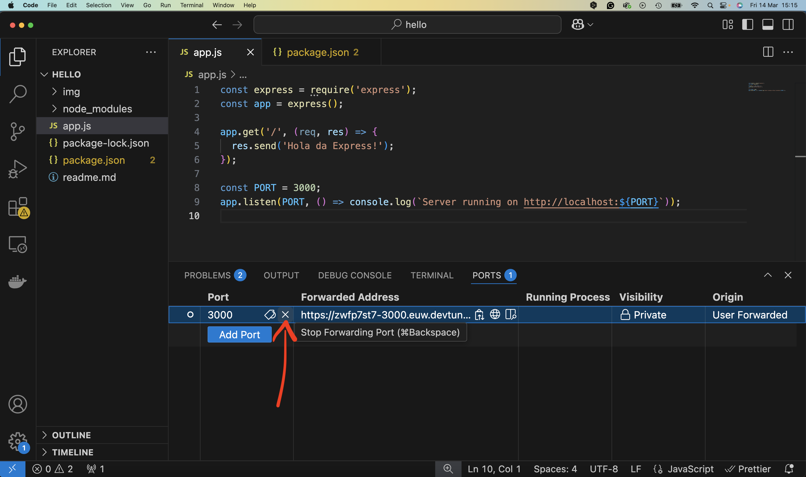

# Setup Node.js in VSC

##  1. **Installa Node.js**

1. Vai al sito ufficiale di Node.js: [https://nodejs.org](https://nodejs.org)

2. Scarica la **versione LTS (Long Term Support)** (consigliata per stabilità).

3. Installa Node.js seguendo la procedura guidata. Questo installerà anche **npm** (Node Package Manager), necessario per gestire le dipendenze.

**Verifica installazione**:
Apri il **terminal** o il prompt dei comandi e scrivi:

```
node -v
npm -v
```
Ti deve restituire la versione installata di entrambi.

##  2. **Installa Visual Studio Code (VSC)**

1. Scarica VSC da: [https://code.visualstudio.com](https://code.visualstudio.com)

2. Installa normalmente.

##  3. **Installa Estensioni Utili per Node.js in VSC**

In VSC, vai su **Estensioni (icona dei quadratini a sinistra)** e cerca e installa:

-  **Node.js Extension Pack** pubblicato da walkme (include vari strumenti utili per Node)

Se vuoi puoi anche installare:

-  **ESLint** (per linting del codice)
-  **Prettier** (per formattazione automatica)

##  4. **Crea una Nuova Cartella per il Progetto**

1. Crea una cartella dove vuoi sviluppare l'app.
2. Apri VSC e scegli **File > Open Folder** per aprire la cartella.

##  5. **Inizializza il Progetto Node.js**

Apri il terminale integrato in VSC (**View > Terminal** o `Ctrl + ò` su Windows/`Cmd + ò` su Mac).

Nel terminale, esegui:

```
npm init -y
```
Questo crea un file `package.json` che descrive il tuo progetto e le dipendenze.


##  6. **Crea il File Principale (es. app.js)**

Esempio:

```
console.log('Hello, Node.js!');
```


##  7. **Esegui l'App per Test**

Nel terminale:

```
node app.js
```

Se vedi "Hello, Node.js!", funziona tutto!


##  8. **Installare Express (se serve un server web)**

Se stai facendo un'app web con server, puoi installare **Express.js**:

```
npm install express
```

Esempio di server base:

```
const express = require('express');
const app = express();

app.get('/', (req, res) => {
  res.send('Hello World from Express!');
});

const PORT = 3000;
app.listen(PORT, () => console.log(`Server running on http://localhost:${PORT}`));
```

Per avviare:
```
node index.js
```


##  9. **(Opzionale) Installare Nodemon per lo sviluppo**

Per riavviare automaticamente il server ad ogni modifica:

```
npm install --save-dev nodemon
```

Aggiorna il file `package.json` aggiungendo uno script:

```
"scripts": {
  "start": "node app.js",
  "dev": "nodemon app.js"
}
```

Ora puoi avviare il server in modalità sviluppo con:

```
npm run dev 
```

Se cambi l'esempio di server base:

```
const express = require('express');
const app = express();

app.get('/', (req, res) => {
  res.send('Ciao da Express!');
});

const PORT = 3000;
app.listen(PORT, () => console.log(`Server running on http://localhost:${PORT}`));
```

e ricarichi la pagina [http://localhost:3000/](http://localhost:3000/), vedrai scritto "Ciao da Express!"

## 10. Pubblicare l'applicazione su Internet

In questo momento l'applicazione è visibile solo sul tuo dispositivo su  [http://localhost:3000/](http://localhost:3000/). Se vuoi rapidamente pubbicare l'applicazione su Internet, in modo che sia raggiungibile da altri dispositivi, puoi usare la funzione "port forwarding" di VSC.

Cerca il tab PORTS



Aggiungi un port forward (serve un'utenza su github)



Ecco il risultato. A questo punto l'applicazione è disponibile all'indirizzo nella colonna Forwarded Address.



Ricordati di togliere il forward.



## **Riepilogo Azioni Chiave**

| Azione                        | Comando                     |
|---|---|
| Inizializzare progetto Node   | `npm init -y`              |
| Avviare app con Node.js       | `node index.js`           |
| Installare pacchetto (es. express) | `npm install express`  |
| Avviare app con Nodemon       | `npm run dev`              |
| Pubblicazione su internet | port forwarding |


 

