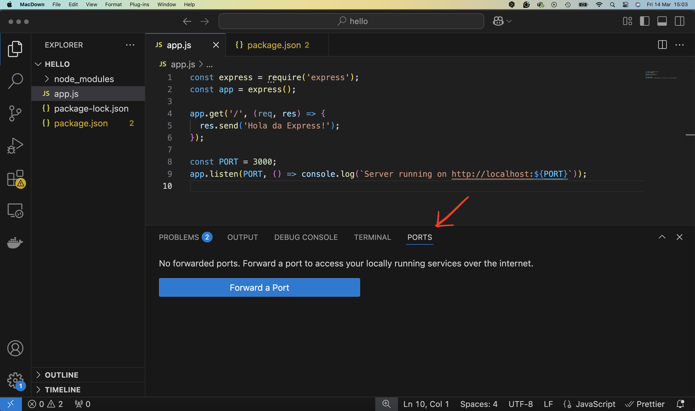
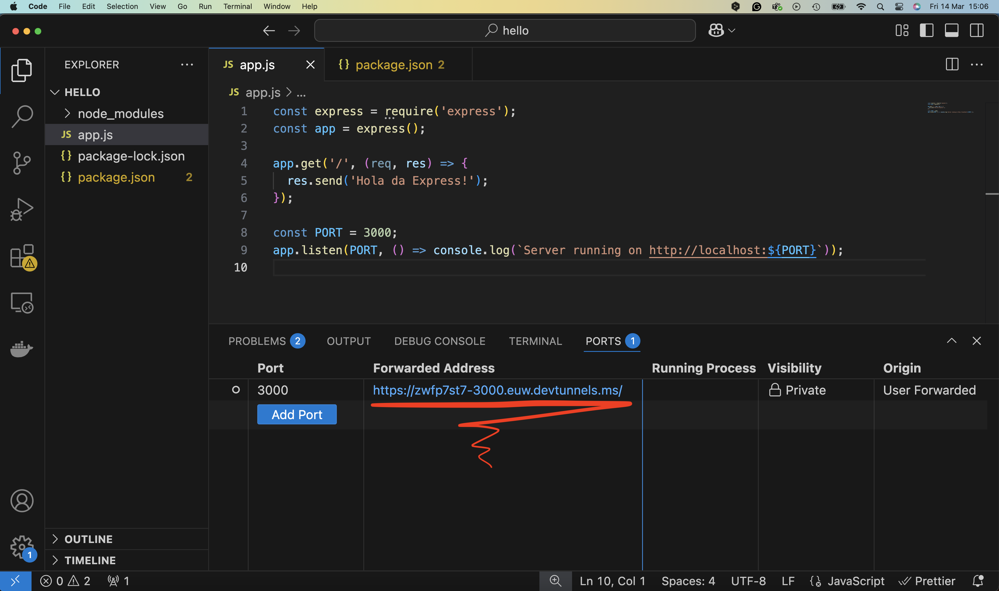

# Setup Node.js in VSC

## 1. **Install Node.js**

1. Go to the official Node.js website: [https://nodejs.org](https://nodejs.org)

2. Download the **LTS (Long Term Support) version** (recommended for stability).

3. Install Node.js following the guided procedure. This will also install **npm** (Node Package Manager), which is necessary to manage dependencies.

**Verify installation**:
Open the **terminal** or command prompt and type:

```
node -v
npm -v
```
It should return the installed version of both.

## 2. **Install Visual Studio Code (VSC)**

1. Download VSC from: [https://code.visualstudio.com](https://code.visualstudio.com)

2. Install as normal.

## 3. **Install Useful Node.js Extensions in VSC**

In VSC, go to **Extensions (icon with squares on the left)** and search for and install:

- **Node.js Extension Pack** published by walkme (includes various useful tools for Node)

If you want you can also install:

- **ESLint** (for code linting)
- **Prettier** (for automatic formatting)

## 4. **Create a New Folder for the Project**

1. Create a folder where you want to develop the app.
2. Open VSC and choose **File > Open Folder** to open the folder.

## 5. **Initialise the Node.js Project**

Open the terminal integrated in VSC (**View > Terminal** or `Ctrl + ò` on Windows/`Cmd + ò` on Mac).

In the terminal, run:

```
npm init -y
```
This creates a `package.json` file that describes your project and dependencies.


## 6. **Create the Main File (e.g. app.js)**

Example:

```
console.log(‘Hello, Node.js!’);
```


## 7. **Run the Test App**

In the terminal:

```
node app.js
```

If you see ‘Hello, Node.js!’, everything is working!


## 8. **Install Express (if you need a web server)**

If you are making a web app with a server, you can install **Express.js**:

```
npm install express
```

Basic server example:

```
const express = require(‘express’);
const app = express();

app.get(‘/’, (req, res) => {
res.send(‘Hello World from Express!’);
});

const PORT = 3000;
app.listen(PORT, () => console.log(`Server running on http://localhost:${PORT}`));
```

To start:
```
node index.js
```


## 9. **(Optional) Install Nodemon for development**

To automatically restart the server every time you make a change:

```
npm install --save-dev nodemon
```

Update the `package.json` file by adding a script:

```
‘scripts’: {
‘start’: ‘node app.js’,
‘dev’: ‘nodemon app.js’
}
```

Now you can start the server in development mode with:

```
npm run dev 
```

If you change the basic server example:

```
const express = require(‘express’);
const app = express();

app.get(‘/’, (req, res) => {
res.send(‘Hello from Express!’);
});

const PORT = 3000;
app.listen(PORT, () => console.log(`Server running on http://localhost:${PORT}`));
```

and reload the page [http://localhost:3000/](http://localhost:3000/), you'll see ‘Hello from Express!’

## 10. Publish the application on the Internet

At the moment the application is only visible on your device at [http://localhost:3000/](http://localhost:3000/). If you want to quickly publish the application on the Internet, so that it can be reached by other devices, you can use the VSC ‘port forwarding’ function.

Look for the PORTS tab



Add a port forward (you need an account on github)


Here is the result. At this point the application is available at the address in the Forwarded Address column.



Remember to remove the forward.


## **Summary of Key Actions**

| Action | Command |
|---|---|
| Initialise Node project | `npm init -y` |
| Start app with Node.js | `node index.js` |
| Install package (e.g. express) | `npm install express` |
| Start app with Nodemon | `npm run dev` |
| Publish on the internet | port forwarding |


